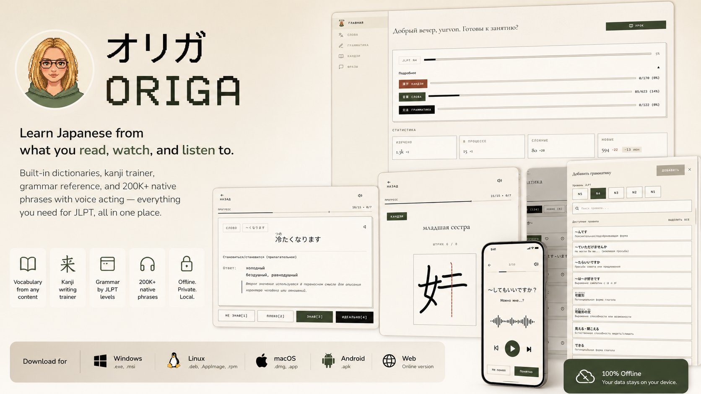
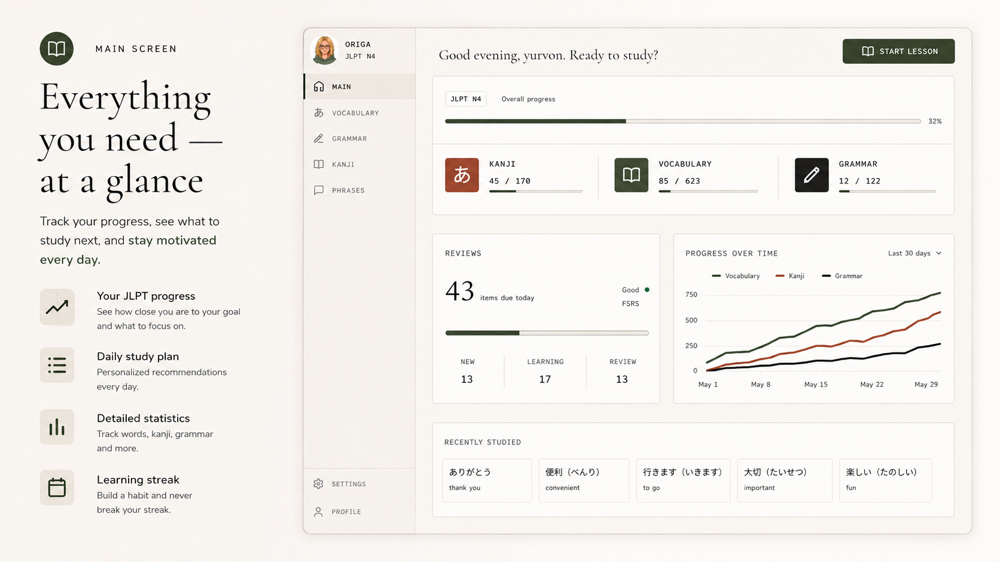
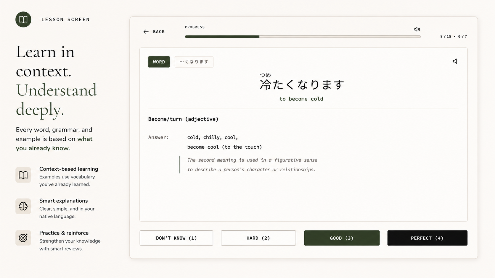

# Origa　「オリガ」

[🇬🇧 English](./README.md) | [🇷🇺 Русский](./README.ru.md) | 🇰🇷 한국어 | [🇻🇳 Tiếng Việt](./README.vi.md)

---

**영어 중간 매개 없이 일본어를 배우세요.**

オリガ는 일본어 학습과 JLPT 시험 대비를 위한 올인원 앱입니다.

간격 반복 알고리즘(FSRS), 내장 OCR, 텍스트 및 음성 인식 — AI 처리는 기기 내에서 로컬로 실행됩니다. 인터넷 연결은 첫 로그인과 초기 콘텐츠 다운로드 시에만 필요합니다.

---

## 🎯 원칙

* **내 콘텐츠로 학습** — 무엇을 공부할지는 여러분이 선택합니다. 앱은 여러분이 이미 아는 것과 지금 읽고, 보고, 듣고 있는 콘텐츠에 맞춰 적응합니다.
* **스마트한 알고리즘** — FSRS 간격 반복 시스템(Anki와 유사)이 단어마다 복습 간격을 최적화합니다.
* **프라이버시** — 모든 AI 모델은 기기에서 로컬로 실행됩니다. 사진, 오디오, 학습 활동은 기기에서 처리되며 외부로 전송되지 않습니다.
* **오프라인 우선** — 초기 설정 이후에는 인터넷 없이 모든 기능을 사용할 수 있습니다.
* **크로스 플랫폼** — Web, Windows, Linux, macOS, Android.
* **모국어로 학습** — 인터페이스와 사전이 러시아어, 영어, 한국어, 베트남어를 지원합니다(인도네시아어와 스페인어는 계획 중).
* **JLPT 분석** — 현재 레벨을 추적하고 학습 진행 상황을 예측합니다.

---

## ✨ 기능

### 어휘

* 모국어로 제공되는 내장 사전.
* 초고속 카드 생성 — 일본어 단어나 문장을 입력하기만 하면 됩니다.
* 텍스트, 사진, 오디오에서 단어를 자동 인식하고 추출합니다.
* 다른 인기 앱과 고전 교과서의 기성 단어 세트를 가져올 수 있습니다.
* 올바른 발음이 담긴 내장 오디오 뱅크(NHK 및 기타 신뢰할 수 있는 출처 기반).

### 한자

* 모든 학습 콘텐츠에 후리가나가 자동으로 생성됩니다.
* 스마트 숨김: 학습을 마친 한자는 더 이상 후리가나가 표시되지 않아 독해력을 단련합니다.
* 올바른 획순으로 쓰기 연습을 하는 한자 필기 트레이너.
* JLPT 레벨 N5–N1에 엄격하게 매핑된 내장 한자 사전.
* 대화형 한자 읽기 테스트.

### 문법

* JLPT 레벨 N5–N1 전체를 커버하는 체계적인 내장 문법 참고서.
* 맥락 속 학습: 문법 규칙은 *이미 학습한* 단어로 설명됩니다.
* 문법 패턴을 확실히 다지는 연습 테스트.

### 문장과 듣기

* 네이티브 일본어 콘텐츠(비주얼 노벨, 애니메이션)에서 가져온 20만 개 이상의 문장을 오리지널 음성과 함께 내장.
* 현재 어휘를 기준으로 레슨에 넣을 문장을 자동 선정(N+1 방식).
* 듣기 및 음성 이해 연습.
* 회화와 일상 일본어에 대한 몰입.

---

## 📥 다운로드

| 플랫폼 | 상태 | 형식 |
| :--- | :--- | :--- |
| **Windows** | ✅ 지원 | `.exe`, `.msi` |
| **Linux** | ✅ 지원 | `.deb`, `.AppImage`, `.rpm` |
| **macOS** | ✅ 지원 | `.dmg`, `.app` |
| **Android** | ✅ 지원 | `.apk` |

> 모든 버전이 오프라인 모드를 지원합니다.

웹 버전도 이용할 수 있습니다.

---

## 🌍 인터페이스 언어

| 언어 | 상태 |
| :--- | :--- |
| **한국어, 영어, 러시아어, 베트남어** | ✅ 사용 가능 |
| **인도네시아어, 스페인어** | 📋 계획 중 |

---

## 🏗️ 아키텍처 및 기술

이 프로젝트는 네이티브 앱의 성능과 웹 인터페이스의 유연성을 모두 제공하는 현대적인 스택으로 만들어졌습니다.

* **코어 및 백엔드**: **Rust** — 안전성과 고속 데이터 처리.
* **데스크톱 래퍼**: **Tauri v2** — Windows, macOS, Linux용 네이티브 앱.
* **프론트엔드**: **Leptos** — 즉각적인 인터페이스 반응성을 위한 Rust(WebAssembly) 기반 리액티브 UI 프레임워크.
* **모바일**: Tauri Mobile을 통한 네이티브 **Android** 빌드.

---

## 🚀 로드맵

* 모바일 플랫폼: iOS 출시.
* 소셜 기능: 사용자 간 대결.
* 새로운 연습 유형: 텍스트, 만화, 맥락 문장, 오디오, 비디오 읽기.
* 현지화: 인도네시아어와 스페인어 추가.

---

## 📊 다른 앱과의 비교

*Origa가 인기 도구들과 어떻게 다른지, 그리고 함께 어떻게 사용할 수 있는지.*

### Anki

어떤 소재든 학습할 수 있는 강력하고 유연한 간격 반복 앱.

* **Anki를 사용할 때:** 완전한 커스터마이징 자유, 직접 만든 HTML/CSS 카드, 일본어 외의 여러 과목 학습이 필요할 때.
* **Origa의 장점:** 카드 생성 시간 절약, 자기 콘텐츠 빠른 불러오기, 단어 + 한자 + 문법이 하나의 생태계 안에서 작동합니다.

### ReWord

카드 방식으로 어휘를 암기하는 앱.

* **ReWord를 사용할 때:** 빠르게 시작해 맥락 없는 기초 단어 목록을 기계적으로 외우고 싶을 때.
* **Origa의 장점:** 어휘가 여러분의 콘텐츠, 문법, 네이티브 오디오와 연결되어 언어를 더 깊이 이해하게 됩니다.

### Bunpro

문법 특화 트레이너(Grammar SRS).

* **Bunpro를 사용할 때:** 오직 문법 규칙 연습에만 집중하고 싶을 때.
* **Origa의 장점:** 문법 예문이 *이미 학습한 단어*로 만들어집니다 — 어휘와 문법이 하나로 작동합니다.

### WaniKani

인기 있는 외우기 쉬운 연상법(니모닉) 기반 한자·단어 학습 서비스.

* **WaniKani를 사용할 때:** 라디칼 기반의 정해진 순서로 한자를 처음부터 차근차근 배우는 방식이 잘 맞을 때.
* **Origa의 장점:** 만화, 기사, 업무에서 오늘 실제로 만난 한자와 단어를 바로 학습합니다.

### Duolingo

언어 환경에 가볍게 몰입하게 해 주는 재미있는 앱.

* **Origa와의 조합:** 가벼운 입문과 초기 단어·한자 기초는 Duolingo로. Origa가 그 내용을 다져주고, 문법 빈틈을 메우고, 게임형 학습을 실전 활용으로 전환시켜 줍니다.

### Migii

진지한 JLPT 시험 대비 시뮬레이터.

* **Origa와의 조합:** 시간을 재며 실전 문제를 푸는 연습은 Migii로. Origa가 시험에 필요한 모든 자료를 종합적으로 모으고 다져주는 기반이 됩니다.

---

## 📄 라이선스

이 프로젝트는 BSL 1.1(Business Source License 1.1)로 배포됩니다.

의미하는 바:

* ✅ 개인적인 목적으로 코드를 자유롭게 사용, 학습, 수정할 수 있습니다.
* ✅ 직접 앱을 빌드할 수 있습니다.
* ❌ 저자의 명시적 동의 없이 코드를 공개 상용 서비스(SaaS)로 제공하거나 판매하는 것은 금지됩니다.

일정 기간이 지나면(또는 조건이 충족되면) 라이선스는 더 개방적인 라이선스(예: Apache 2.0 또는 MIT)로 전환될 수 있습니다.

자세한 내용은 LICENSE 파일을 참고하세요. 위 번역은 참고용이며 법적 효력은 LICENSE 원문에 있습니다.

## 📬 연락처

* GitHub Issues: 버그 보고 및 기능 제안.
* Discussions: 일반적인 질문과 아이디어 논의.
* 일본어와 기술을 사랑으로 만들었습니다. 🇯🇵💻
