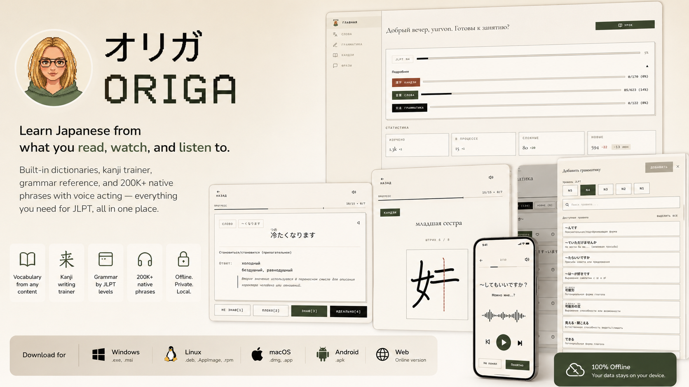
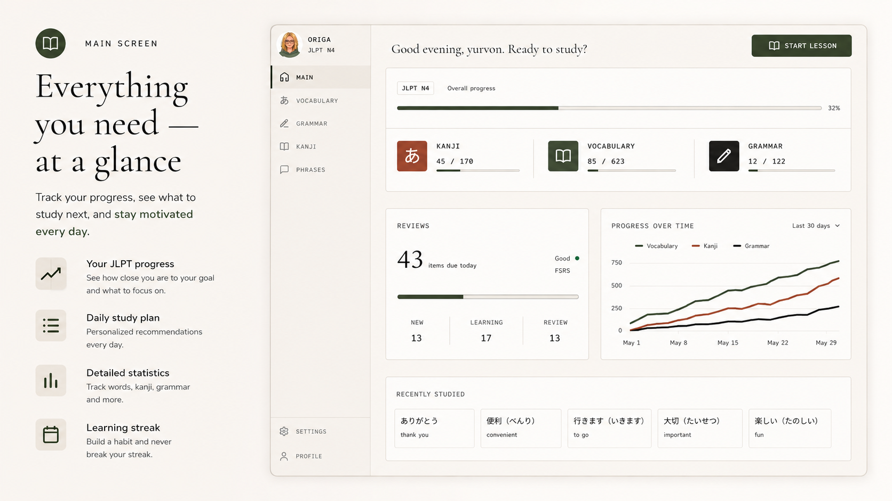
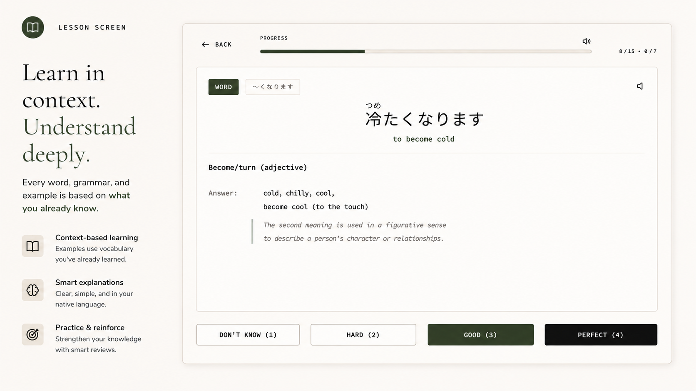

# Origa　「オリガ」

[🇬🇧 English | 🇷🇺 Русский](./README.ru.md)

---

**Learn Japanese without an English middleman.**

オリガ is a comprehensive app for learning Japanese and focused preparation for the JLPT exam.

Spaced repetition algorithms (FSRS), built-in OCR, text and audio recognition — everything runs locally on your device, with no data sent to the cloud.

---

## 🎯 Principles

* **Learn from your own content** — you choose what to study. The app adapts to what you already know and what you're reading, watching, or listening to right now.
* **Smart algorithms** — FSRS spaced repetition system (like Anki) optimizes review intervals for each word.
* **Privacy** — all AI models and data processing run locally, nothing is sent to the cloud.
* **Offline-first** — full functionality without internet.
* **Cross-platform** — Web, Windows, Linux, macOS, Android.
* **Learn in your language** — interface and dictionaries in Russian and English (more languages planned).
* **JLPT analytics** — track your current level and forecast your progress.

---

## ✨ Features

### Vocabulary

* Built-in dictionaries in your native language.
* Ultra-fast card creation — just type a word or sentence in Japanese.
* Automatic recognition and extraction of vocabulary from text, photos, and audio.
* Import ready-made word sets from other popular apps and classic textbooks.
* Built-in audio bank with correct pronunciation (based on NHK and other reliable sources).

### Kanji

* Automatic furigana generation for all study content.
* Smart hiding: learned kanji no longer show furigana, training your reading skills.
* Proper kanji writing trainer.
* Built-in kanji dictionaries strictly mapped to JLPT levels.
* Interactive kanji reading tests.

### Grammar

* Built-in structured grammar reference mapped to JLPT levels.
* Contextual learning: grammar rules are explained using words you've *already* learned.
* Practical tests to reinforce grammar patterns.

### Phrases & Listening

* Built-in database of 200,000+ phrases from native Japanese content (visual novels, anime) with original voice acting.
* Automatic phrase selection for lessons based on your current vocabulary (N+1 approach).
* Listening and speech comprehension practice.
* Immersion in conversational and everyday Japanese.

---

## 📥 Download

| Platform | Status | Format |
| :--- | :--- | :--- |
| **Windows** | ✅ Ready | `.exe`, `.msi` |
| **Linux** | ✅ Ready | `.deb`, `.AppImage`, `.rpm` |
| **macOS** | ✅ Ready | `.dmg`, `.app` |
| **Android** | ✅ Ready | `.apk` |

> All versions support offline mode.

A web version is also available.

---

## 🌍 Interface Languages

| Wave | Languages | Status |
| :--- | :--- | :--- |
| **1st** | Russian, English | ✅ In progress |
| **2nd** | Vietnamese | 📋 Planned |
| **3rd** | Korean | 📋 Planned |
| **4th** | Indonesian | 📋 Planned |
| **5th** | Spanish | 📋 Planned |

---

## 🏗️ Architecture & Technologies

The project is built on a modern stack that delivers native app performance with web interface flexibility.

* **Core & backend**: **Rust** — safety and high-speed data processing.
* **Desktop wrapper**: **Tauri v2** — native apps for Windows, macOS, and Linux.
* **Frontend**: **Leptos** — reactive UI framework in Rust (WebAssembly) for instant interface response.
* **Mobile**: Native **Android** build via Tauri Mobile.

---

## 🚀 Roadmap

* Mobile platforms: iOS release.
* Social features: competitions between users.
* New exercise types: reading texts, manga, contextual sentences, audio, video.
* Localization expansion to new languages (Vietnamese, Korean, Indonesian, Spanish).

---

## 📊 Comparison with Other Apps

*How Origa compares to popular tools and how you can use them together.*

### Anki

A powerful and flexible spaced repetition app for any material.

* **When to use Anki:** you need absolute customization freedom, custom HTML/CSS cards, or you're studying many subjects beyond Japanese.
* **Origa's advantage:** save time creating cards, quickly load your content, with vocabulary + kanji + grammar in a single ecosystem.

### ReWord

A flashcard-based vocabulary memorization app.

* **When to use ReWord:** quick start and mechanical memorization of basic word lists without context.
* **Origa's advantage:** vocabulary is tied to your content, grammar, and native audio — giving you a deeper understanding of the language.

### Bunpro

A specialized grammar trainer (Grammar SRS).

* **When to use Bunpro:** you want to focus exclusively on drilling grammar rules.
* **Origa's advantage:** grammar examples are built on *words you've already learned* — vocabulary and grammar work as a unified whole.

### WaniKani

A popular kanji and vocabulary learning service using mnemonics.

* **When to use WaniKani:** a rigid order of learning kanji by radicals from scratch works for you.
* **Origa's advantage:** you learn exactly the kanji and words you encountered today — in manga, an article, or at work.

### Duolingo

An engaging app that gradually immerses you in a language.

* **Pair with Origa:** use Duolingo for an easy start and initial vocabulary and kanji base. Origa will reinforce that material, fill grammar gaps, and transition knowledge from a gamified form into practical use.

### Migii

A serious JLPT test preparation simulator.

* **Pair with Origa:** use Migii to practice solving exam tests against the clock. Origa serves as your foundation to comprehensively collect and reinforce all the material needed to pass those tests.

---

## 📄 License

This project is distributed under the BSL 1.1 (Business Source License 1.1).

What this means:

* ✅ You may freely use, study, and modify the code for personal purposes.
* ✅ You may build the app for yourself.
* ❌ Using the code to provide public commercial services (SaaS) or reselling it is prohibited without explicit agreement from the authors.

After a certain period (or when conditions are met), the license may convert to a more open one (e.g., Apache 2.0 or MIT).

See the LICENSE file for details.

## 📬 Contacts

* GitHub Issues: for bug reports and feature requests.
* Discussions: for general questions and idea discussions.
* Made with love for the Japanese language and technology.
