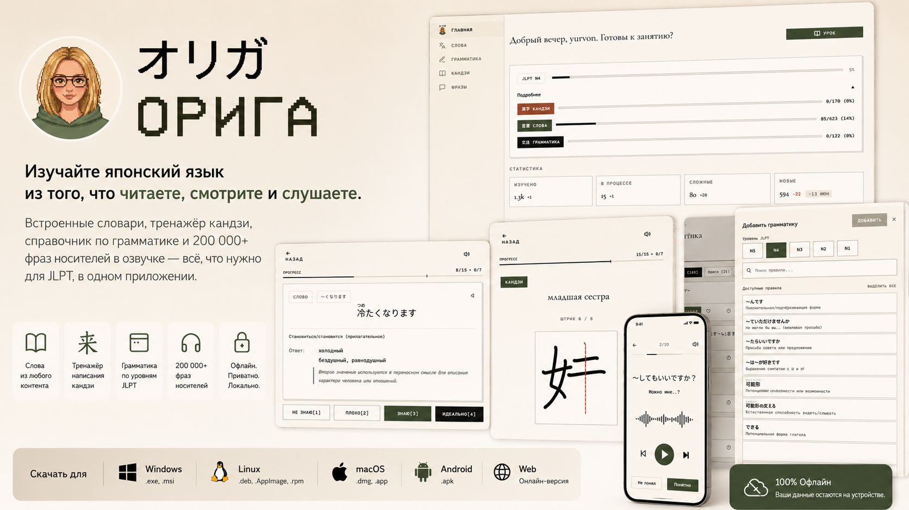
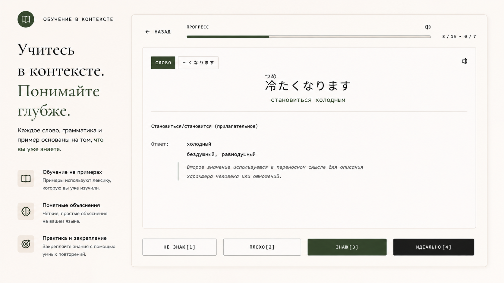

# Origa　「オリガ」

[🇬🇧 English](./README.md) | 🇷🇺 Русский

---

**Японский язык без английского посредника.**

オリガ — это комплексное приложение для изучения японского языка
и целенаправленной подготовки к экзамену JLPT.

Алгоритмы интервального повторения (FSRS), встроенный OCR,
распознавание текста и аудио — всё работает локально на вашем устройстве,
без отправки данных в облако.

---

## 🎯 Принципы

* **Обучение по вашему контенту** — вы выбираете, что изучать. Приложение адаптируется под то, что вы уже знаете, и то, что вы читаете, смотрите или слушаете прямо сейчас.
* **Умные алгоритмы** — система интервального повторения FSRS (как в Anki) оптимизирует интервалы повторения для каждого слова.
* **Конфиденциальность** — все ИИ-модели и обработка данных работают локально, без отправки в облако.
* **Автономность** — полноценная работа без интернета.
* **Кросс-платформенность** — Web, Windows, Linux, macOS, Android.
* **Обучение на родном языке** — интерфейс и словари на русском и английском (расширение языков в планах).
* **Аналитика JLPT** — отслеживание текущего уровня и прогнозирование прогресса.

---

## ✨ Возможности

### Лексика

* Встроенные словари на родном языке пользователя.
* Сверхбыстрое создание карточек — достаточно ввести лишь слово или предложение на японском.
* Автоматическое распознавание и извлечение лексики из текста, фото и аудиоматериалов.
* Импорт готовых наборов слов из других популярных приложений и классических учебников.
* Встроенный аудиобанк с правильным произношением слов (на базе NHK и других достоверных источников).

### Иероглифы

* Автоматическая генерация фуриганы ко всему изучаемому контенту.
* Умное скрытие: изученные кандзи больше не сопровождаются фуриганой для тренировки чтения.
* Тренажер правильного написания кандзи.
* Встроенные словари кандзи со строгой привязкой к уровням JLPT.
* Интерактивные тесты на чтение иероглифов.

### Грамматика

* Встроенный структурированный справочник грамматики с привязкой к уровням JLPT.
* Контекстное обучение: правила грамматики объясняются на примерах тех слов, которые вы *уже* выучили ранее.
* Практические тесты для закрепления грамматических конструкций.

### Фразы и аудирование

* Встроенная база (более 200 000 фраз) из нативного японского контента (визуальные новеллы, аниме) с оригинальной озвучкой.
* Автоматический подбор фраз для уроков на основе текущего словарного запаса (N+1 подход).
* Практика аудирования и восприятия речи на слух.
* Погружение в разговорную и повседневную часть японского языка.

---

## 📥 Скачать

| Платформа | Статус | Формат |
| :--- | :--- | :--- |
| **Windows** | ✅ Готово | `.exe`, `.msi` |
| **Linux** | ✅ Готово | `.deb`, `.AppImage`, `.rpm` |
| **macOS** | ✅ Готово | `.dmg`, `.app` |
| **Android** | ✅ Готово | `.apk` |

> Все версии поддерживают оффлайн-режим работы.

Также доступна web-версия.

---

## 🌍 Языки интерфейса

| Волна | Языки | Статус |
| :--- | :--- | :--- |
| **1-я** | Русский, Английский | ✅ |
| **2-я** | Вьетнамский | 📋 В планах |
| **3-я** | Корейский | 📋 В планах |
| **4-я** | Индонезийский | 📋 В планах |
| **5-я** | Испанский | 📋 В планах |

---

## 🏗️ Архитектура и технологии

Проект построен на современном стеке, обеспечивающем
производительность нативного приложения и гибкость веб-интерфейса.

* **Ядро и бэкенд**: **Rust** — безопасность и высокая скорость
  обработки данных.
* **Десктопная обертка**: **Tauri v2** — нативные приложения для
  Windows, macOS и Linux.
* **Фронтенд**: **Leptos** — реактивный UI-фреймворк на Rust
  (WebAssembly), обеспечивающий мгновенный отклик интерфейса.
* **Мобильная версия**: Нативная сборка под **Android**
  через Tauri Mobile.

---

## 🚀 Планы развития

* Мобильные платформы: релиз для iOS.
* Социальные функции: соревнования между пользователями.
* Новые типы упражнений: чтение текстов, манги, контекстные предложения, аудио, видео.
* Расширение локализации на новые языки (вьетнамский, корейский, индонезийский, испанский).

---

## 📊 Сравнение с другими приложениями

*Как Origa соотносится с популярными инструментами и как их можно использовать вместе.*

### Anki

Мощное и гибкое приложение интервальных повторений для любых материалов.

* **Когда использовать Anki:** нужна абсолютная свобода кастомизации, свои HTML/CSS-карточки или изучение множества предметов помимо японского.
* **Преимущество Origa:** экономия времени на создании карточек, быстрая загрузка своего контента, слова + кандзи + грамматика в единой экосистеме.

### ReWord

Приложение для заучивания лексики с помощью карточек.

* **Когда использовать ReWord:** быстрый старт и механическое запоминание базовых списков слов без контекста.
* **Преимущество Origa:** лексика связана с вашим контентом, грамматикой и нативным аудио — более глубокое понимание языка.

### Bunpro

Специализированный тренажёр грамматики (Grammar SRS).

* **Когда использовать Bunpro:** фокус исключительно на отработке грамматических правил.
* **Преимущество Origa:** примеры грамматики строятся на *словах, которые вы уже выучили* — лексика и грамматика работают как единое целое.

### WaniKani

Сервис для изучения кандзи и слов с помощью мнемоники.

* **Когда использовать WaniKani:** подходит жёстко заданный порядок изучения иероглифов по радикалам с нуля.
* **Преимущество Origa:** вы изучаете именно те кандзи и слова, которые встретились вам сегодня — в манге, статье или на работе.

### Duolingo

Затягивающее приложение для погружения в языковую среду.

* **Связка с Origa:** используйте Duolingo для лёгкого старта и начальной базы слов и кандзи. Origa закрепит этот материал, закроет пробелы в грамматике и переведёт знания из игровой формы в практическую.

### Migii

Серьёзный симулятор для подготовки к тестам JLPT.

* **Связка с Origa:** используйте Migii для практики решения экзаменационных тестов на время. Origa станет фундаментом, который комплексно соберёт и закрепит весь необходимый для экзамена материал.

---

## 📄 Лицензия

Проект распространяется под лицензией BSL 1.1
(Business Source License 1.1).

Что это значит:

* ✅ Вы можете свободно использовать, изучать и модифицировать
  код для личных целей.
* ✅ Вы можете собирать приложение для себя.
* ❌ Запрещено использование кода для предоставления публичных
  коммерческих сервисов (SaaS) или перепродажи без явного
  соглашения с авторами.

По истечении определенного срока (или при выполнении условий)
лицензия может конвертироваться в более открытую
(например, Apache 2.0 или MIT).

Подробности см. в файле LICENSE.

## 📬 Контакты

* GitHub Issues: Для сообщений об ошибках и предложений функций.
* Обсуждения: Для общих вопросов и обсуждения идей.
* Сделано с любовью к японскому языку и технологиям. 🇯🇵💻
