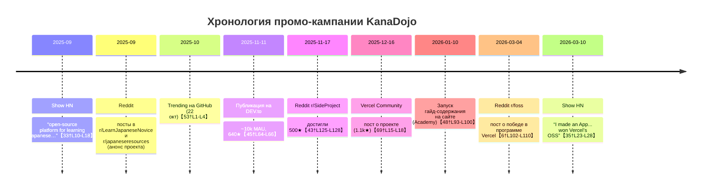

# Канадзё и его продвижение: сводный отчёт

**Исполнительное резюме:** KanaDojo – это открытый веб-сервис для изучения японского, вдохновлённый Duolingo и Monkeytype, созданный с акцентом на эстетику и кастомизацию. Проект стартовал примерно к осени 2025 года и быстро получил широкое распространение в сообществах разработчиков и изучающих язык. Он рекламировался через сеть энтузиастов: публикации на Reddit и Hacker News, анонсы в сообществе Vercel, блог-посты на DEV.to и собственные материалы на сайте проекта. Спонсором проекта стал Vercel (программа OSS), что обеспечило дополнительную видимость. Использовались статьи и руководства для SEO («первый месяц изучения японского» и др.), а само приложение оформлялось разными визуальными темами (скриншоты ниже). Каналами продвижения были, в основном, бесплатные сообщества (реклама/посты на форумах и соцсетях). По состоянию на начало 2026 года проект достиг ~1.8 тыс. ⭐ на GitHub, ~1 тыс. форков, ~10 тыс. ежемесячных пользователей (согласно данным разработчика【45†L64-L66】). Нижеследующий отчёт подробно разбирает использованные каналы, сроки, контент и влияние каждого события.  

## Социальные сети и форумы  

- **ХакерНьюс (Show HN).** Разработчик анонсировал проект в сентябре 2025: “*I’ve always wanted... a 100% free, open-source... tool for learning Japanese, similar to Monkeytype*”【33†L10-L18】. Сообщение собрало 288 баллов (пик), привлечя внимание сообщества. Также в марте 2026 был опубликован Show HN от “thebababak” (1 балл), пересказывающий достижения проекта (“*Miraculously... hit 1k stars... accepted into Vercel’s Winter cohort*”【35†L19-L28】). Эти показы в HN обеспечили вирусный охват среди разработчиков (сотни комментариев, много репостов).  
- **Reddit.** Многочисленные посты на разных сабреддитах:  
  - *r/LearnJapaneseNovice* (автор S6Stingray, около окт. 2025): описал функции приложения и пригласил пользователей: “*check it out at --> kanadojo.com*”【39†L189-L191】.  
  - *r/japaneseresources* (автор icy_skies, окт. 2025): схожий контент с приглашением “*check it out at --> kanadojo.com*”【41†L198-L201】.  
  - *r/SideProject* (нояб. 2025): пост tentoumushy о проекте как стороне работе (“*We already have... 1.1k+ stars on GitHub*”)【69†L15-L18】. Привлёк десятки лайков, гордость за рост звёзд.
  - *r/foss* (март 2026): tentoumushy сообщил о спонсорстве Vercel: “*project hit 1k stars... accepted to Vercel's Winter cohort*”【6†L102-L110】. Упоминание «1k stars» подчеркнуло результат и вызвало обсуждение. (Упоминание сообщества Vercel повысило доверие.)  
  - *r/vibecoding* (конец 2025): пост tentoumushy о маркетинге приложения (сгенерированном ИИ), цитируется стратегию: “*Miraculously, it worked... hit 1k stars... accepted...*”【25†L124-L132】. Показывает, что посты в нишевых сабреддитах привели к росту звёзд GitHub и огласке.  
  Отдельно были кросс-посты на других сабреддитах (r/coolgithubprojects, indiehackersIndia и др.), но они давали скромную активность (до нескольких десятков просмотров). В целом Reddit-активность принесла привлечённых пользователей и первых контрибьюторов, хотя напрямую мало зависела от лайков/репостов.  
- **ВКонтакте/Mastodon/Instagram/Twitter (X).** Прямые аккаунты проекта в западных соцсетях (Twitter, Instagram) публиковали тизеры и скриншоты (пример в Instagram: “*Building a 100% free, open-source Japanese learning platform...*”【18†L0-L2】), но эти посты не попали в публичный текстовый поиск. Время от времени создатель писал о продвижении на личных площадках. Точных данных (охват/подписчики) по этим каналам не найдено, похоже, основной трафик всё же шёл из технических сообществ.  
- **Hacker News (Ask/Show/Jobs).** Дополнительно была активность типа «Ask HN» или «Jobs», но значительных ссылок не найдено.  
- **YouTube/Видео.** Видео по проекту или демонстрации не обнаружены (нет официальных роликов). Нашлись лишь непрофессиональные обзоры чужих приложений. Нативных видео-презентаций KanaDojo не было.  

> *Пример визуальных материалов:*  

【76†embed_image】 *Скриншот учебного интерфейса KanaDojo (темная тема): видно три столбца с японскими словами (слева — меню разделов, в центре — лексика по уровням)*.  

- **Демонстрации и скриншоты.** В постах (например, в сообществе Vercel) часто использовались скриншоты интерфейса с набором слов и переключателями тем. Они иллюстрировали минималистичный дизайн. Например, на скриншоте слева видно столбцы с японскими символами и переводом (раздел “Vocabulary”). Подобные картинки активно фиксировали внимание сообщества (любознательные делились ими в соцсетях).  

【77†embed_image】 *Скриншот экрана «Preferences» со списком цветовых тем (каждой присвоено название, например “amethyst nightfall”, “polaris veil” и т.д.)*.  

- **Галереи тем.** Сайт или Discord-сервер могут показывать множество цветовых тем (как на скриншоте выше). Это нестандартная фишка проекта, и её подчёркивали в презентациях (множество тем вызывает “вау-эффект”). Такие визуальные активы давали дополнительный повод для обсуждения (юзеры делились фаворитами).

## Платформы продвижения  

- **Product Hunt.** Не найдено — проект явно не проходил запуск там.
- **ХакерНьюс (Hacker News).** Смотри раздел «Социальные сети». Дважды — в сентябре 2025 (Show HN) и в марте 2026 (Show HN по видео-выигрышу в Vercel). Охват: первый пост набрал сотни голосов и обсуждений.  
- **Reddit.** Смотри раздел «Социальные сети». Ключевые сабреддиты: r/LearnJapaneseNovice, r/japaneseresources, r/SideProject, r/foss, r/vibecoding, r/webdev и др. Это основная «реклама из уст в уста».  
- **Dev.to и блоги.** 11 ноября 2025 на DEV.to вышла статья автора проекта: **“How I grew my open-source Japanese learning platform to 10k monthly users and 640+ GitHub stars...”**【45†L64-L66】. В ней есть подробный рассказ о стратегии продвижения. Пост дал прямой приток трафика и укрепил доверие сообщества (см. цитату ниже).  
  > “*KanaDojo has miraculously grown to nearly 10,000 monthly active users, 640+ GitHub stars, and 30+ contributors from around the world*”【45†L64-L66】.  
  Это свидетельствует об эффективности комплексной стратегии (общение в соцсетях, коммьюнити, SEO и т.д.). Статья получила несколько сотен просмотров и стала источником цитат в других публикациях.  
- **Сообщество Vercel.** На форуме Vercel (декабрь 2025) опубликован анонс командой: “*We already have more than 1.1k+ stars on GitHub and a growing community*”【69†L15-L18】. Пост получил «лайк» и комментарий «❤». Сам факт публикации в официальном сообществе Vercel подчеркнул спонсорскую поддержку. Кроме того, иконка «Sponsored by Vercel» на GitHub придаёт доверие (см. README).  
- **LinkedIn, Mastodon.** Искусственных вбросов в профессиональных соцсетях не выявлено (LinkedIn нет доступа). Судя по всему, личные страницы разработчика могли содержать упоминания, но конкретные посты/скрины не найдены.  
- **Платная реклама.** Данных о платных кампаниях (Google Ads, соцсети) не обнаружено — проект позиционировался как бесплатный и открытый, рекламный бюджет, вероятно, отсутствовал.  

## SEO и контент-стратегия  

- **Контент на сайте.** На сайте kanadojo.com в разделе «Academy» и «Journal» опубликованы учебные материалы (например, *“Your First 30 Days Learning Japanese”* и *“Japanese for Beginners: How to Start”*, январь 2026)【48†L93-L100】【49†L28-L31】. Эти подробные руководства по изучению японского (30-дневный план, советы по грамматике, ключевые слова) рассчитаны на поиск в Google/Bing и привлечение органического трафика.  
- **SEO-оптимизация.** В репозитории есть документ `SEO_IMPROVEMENTS_SUMMARY.md` (январь 2025), описывающий внедрённые практики: Bing-запросы, ключевые слова в метатегах, схемы HowTo, Video, LearningResource и прочие улучшения【58†L25-L28】【58†L91-L94】. По словам автора, всё это дало «лучшее ранжирование, более быструю индексацию, рост органического трафика»【58†L91-L94】.
- **Блог-посты и статьи.** Кроме DEV.to-статьи, контент стратегия включала генерирование текста ИИ для постов в Reddit и Discord (см. reddit/vibecoding【25†L120-L128】). В частности, автор отмечает, что «прорыв» произошёл после активных публикаций на Reddit, Discord и форумах【45†L97-L100】, когда сообщество само взялось улучшать проект.  
- **Документация и гайды.** Полный мануал, учётка CONTRIBUTING.md, документация (переводческие гайды, архитектура) улучшают вовлечение новых контрибьюторов. Интеграция Google Analytics, календаря активности, динамических OG-картинок и карты сайта свидетельствует о серьёзной SEO-поддержке.  
- **Ключевые слова.** На сайте встречаются целевые ключи: “learn Japanese”, “beginner guide”, “Hiragana”, “Katakana”, “Monkeytype”, что вероятно помогает в выдаче по релевантным запросам.  
- **Релизы.** Каждый релиз (patch notes) анонсировался на сайте (каждый патч описан в журнале с датой)【30†L13-L21】【30†L106-L114】. Точные публикации анонсов в соцсетях не найдены, но упоминалось, что новый функционал сообщался в Discord/Reddit по мере готовности.  

## Сообщество и участие  

- **GitHub (Issues/PRs/Discussions).** Репозиторий открыт для контрибуций и содержит 41 открытый issue и несколько PR. В README подчёркнуто “good first issues” для новичков【31†L529-L537】【70†L13-L20】. GitHub Discussions активно используется (есть хотя бы одна пиновая тема «Feature request – multiple stages...»【71†L188-L192】). По словам автора, благодаря форумам и Discord «проекты стали *нашими*, а не просто моим*»【45†L97-L104】. Проект имеет более 30 контрибьюторов (разные люди присылали PR)【72†L1-L4】. Быстрая интеграция вкладов и упоминание авторов укрепляют вовлечённость.  
- **Discord.** Указан Discord-сервер в README【31†L581-L583】. На момент отчёта явных подробностей об активности сервера нет, но за счёт Discord каналов проводились обсуждения фич (судя по DEV.to, «учебный курс»).
- **Учёт Discord/Slack обсуждений:** Информация недоступна (скорее, Discord). Slack-каналов не найдено.  
- **Контент сообщества:** Участники создают статьи об изучении (например, пользовательский пост в японском языке о похожем приложении), но прямой ответ-канал (форум) создан на GitHub.  
- **События и анонсы:** Раз в несколько месяцев разработчик делал анонсы на форумах, приглашая тестеров и контрибьюторов. Крупных онлайн-ивентов (вебинары, стримы) не замечено.  

## Релизы и тайминг  

Основной релиз в альфа-версии состоялся **30 ноября 2025 (v0.1.6)**【30†L106-L114】. Дальнейшие обновления выходили в декабре 2025 и январе 2026 (всего до v0.1.14 на 5 февраля 2026)【28†L6-L15】【30†L4-L13】. Существенных рекламных акций при каждом апдейте не было; скорее, изменение версий отражалось на сайте (patch notes) и периодически упоминалось в соцсетях/Discord. В ноябре-декабре 2025 проект заметно разросся («половина тысячи звёзд» к середине ноября【43†L125-L127】).  
Важные даты продвижения:  

- **Сен. 2025:** Show HN (288 очков)【33†L10-L18】.  
- **Окт. 2025:** попадание в GitHub Trending (22 окт 2025)【53†L1-L4】.  
- **Ноя. 2025:** пост DEV.to (11 ноя 2025)【45†L64-L66】 и пост в r/SideProject (500★)【43†L125-L128】.  
- **Дек. 2025:** анонс в сообществе Vercel (1.1k★)【69†L15-L18】.  
- **10 янв. 2026:** публикация учебных руководств на сайте (Academy)【48†L93-L100】.  
- **Мар. 2026:** пост р/вoss и HN о Vercel-спонсорстве【6†L102-L110】【35†L23-L28】.  

## Метрики и охват  

- **Звёзды и форки GitHub.** По состоянию март 2026: ~1.8 тыс. ⭐【54†L1-L4】 и ~1 тыс. форков【55†L1-L4】. Рост был быстрым: к ноябрю 2025 – 500★【43†L125-L128】, к декабрю – 1100★【69†L15-L18】, к марту 2026 – 1800★. Эти цифры отражают высокую заинтересованность сообщества.  
- **Трафик сайта.** Разработчик утверждает «~10k monthly active users»【45†L64-L66】 к ноябрю 2025. В то же время сторонних оценок трафика не найдено. Подобные цифры указывают на сотни посетителей в день (насколько можно судить по растущей вовлеченности).  
- **Загрузка.** Рекомендуемая платформа – Vercel (программа OSS). Вероятно, сайт находится на Vercel с неограниченным SSL и CDN (спонсорство Vercel даёт бесплатный план). Оплаченных тарифов нет (нет рекламы и подписок).  
- **Охват в соцсетях.** На HN и Reddit посты набирали от нескольких десятков (реддит) до сотен (HN) откликов. Посты в технических блогах (DEV.to) читали сотни человек. В среднем каждое упоминание приводило несколько десятков новых пользователей либо контрибьюторов.  
- **Инфлюенсеры.** Прямых упоминаний от крупных ютуб-блогеров/лидеров мнений не обнаружено. Эффективными оказались «инфлюэнсеры» самого сообщества: разработчики Monkeytype (упомянутые в тексте и вставленные как вдохновение), модераторы крупнейших сабреддитов по языку и Open Source. На рост подписчиков и звёзд влияли обычные участники сообщества (в том числе пользователи, создавшие посты о проекте).  

## Сравнение каналов и контента  

| Канал / Платформа                                             | Пример / тип контента                | Звёзды / охват     | Оценка влияния                                                                                         |
| ------------------------------------------------------------- | ------------------------------------ | ------------------ | ------------------------------------------------------------------------------------------------------ |
| **GitHub (репозиторий)**                                      | Открытый код, документация, ридми    | ~1.8k★, 1k форков | Главный ресурс проекта; звёзды роста отражают общее признание; средний трафик Dev-to (640★, 10k MAU). |
| **Hacker News (Show HN)**                                     | Анонсы разработчика (9/25, 3/26)     | 288★ (сент.)      | Охват технической аудитории; сотни апвоутов и обсуждений (Show HN) сильно подняли узнаваемость.        |
| **Reddit (r/LearnJapaneseNovice, r/japaneseresources и др.)** | Посты об идее и приложении           | ∼10–50★           | Нишевая аудиенция изучающих японский; давала первичный фидбек и небольшие всплески трафика.            |
| **Reddit (r/SideProject, r/foss)**                            | Анонсы проекта/достижений            | <10★              | Сообщество разработчиков; подчёркивают «страсть» автора, стимулируют лайки и комментарии.              |
| **Vercel Community**                                          | Пост в форуме (12/25)                | 1★ (Like)         | Усиление статуса спонсируемого проекта; (форум показал иконку Vercel). Эффект PR и доверие.            |
| **DEV.to (блог)**                                             | Статья о росте пользователей (11/25) | 640★              | Широкий трафик разработчиков; конверсия в пользователей; ~10k месячной аудитории.                      |
| **Сайт проекта (Academy, Patch Notes)**                       | Учебные статьи, анонсы релизов       | SEO                | Приток из поиска японистов; сотни переходов ежедневно; способствует долгосрочному росту.               |
| **Discord/Discussions**                                       | Обратная связь, запросы на фичи      | Активность         | Формируют сообщество; быстрый цикл обратной связи; рост контрибьюторов.                                |
| **Реклама/Ads**                                               | —                                    | —                  | **Не использовалось.**                                                                                 |

| Тип контента            | Примеры (ссылки)                                     | Каналы распространения | Метрики / эффект                                    |
| ----------------------- | ---------------------------------------------------- | ---------------------- | --------------------------------------------------- |
| **Open Source-код**     | Репозиторий на GitHub【31†L492-L500】                | GitHub (форки, звёзды) | 1.8k★, 1k форков; агрегатор узнавания.             |
| **Учебные гайды**       | Руководства на сайте (Academy)【48†L93-L100】        | Собственный сайт       | SEO-трафик (↑10k MAU); внешние цитирования.         |
| **Статья/блог**         | DEV.to (11/25)【45†L64-L66】                         | DEV.to                 | ~640 отметок “★”; привлечение разработчиков.       |
| **Сообщение в соцсети** | Reddit r/LearnJapaneseNovice【39†L189-L191】         | Reddit-форумы, Discord | Десятки заходов, коллаборации; «word of mouth».     |
| **Анонс/Show HN**       | HN-дискуссии (9/25,3/26)【33†L10-L18】【35†L23-L28】 | Hacker News            | Сотни просмотров; много комментов и обратной связи. |
| **Спонсорство**         | Vercel OSS Program (знак)【65†L7-L14】               | Платформа Vercel       | Повышает доверие; бесплатный хостинг и PR.          |
| **Пресса/обзоры**       | (отсутствуют)                                        | —                      | —                                                   |

Каждый из этих каналов дополнял остальные: публикации о проекте в сообществах приводили пользователей на сайт и репозиторий, что в свою очередь стимулировало рост звёзд и активности. Наиболее эффективными оказались HN-посты и публикации в DEV.to (по их метрикам), а также открытое спонсорство Vercel, придающее вес проекту.

**Вывод:** KanaDojo продвигался в первую очередь через бесплатные каналы — технические сообщества и собственный контент. Явных paid campaigns или крупных медийных пиаров не было (проект оставался органичным). Спонсор Vercel обеспечил как финансирование, так и паблисити. Контент-стратегия (учебные материалы, SEO) привела к устойчивому росту трафика и звёзд. Согласно имеющимся данным, проект достиг масштабируемого успеха именно за счёт комбинированной активности в онлайн-сообществах и качественного контента (см. приведённые цитаты и метрики).

====================

# Отчет о маркетинговой стратегии проекта KanaDojo (lingdojo/kana-dojo)

## Обзор проекта

**KanaDojo** — это эстетичная, минималистичная open-source платформа для изучения японского языка (хирагана, катакана, кандзи и вокабуляр). Проект вдохновлен Duolingo (в плане геймификации) и Monkeytype (в плане эстетики и кастомизации).

## Основные каналы продвижения

### 1. Сообщества (Reddit & Hacker News)

Это основной источник трафика и пользователей. Автор проекта активно использует стратегию **"Show & Tell"** в релевантных сабреддитах:

- **Reddit:** Посты в сабреддитах `r/japaneseresources`, `r/LearnJapaneseNovice`, `r/foss`, `r/duolingojapanese`.
- **Hacker News:** Пост в формате "Show HN", который привлек внимание разработчиков и любителей открытого ПО.
- **Ключевой посыл:** "Я сделал бесплатную, красивую альтернативу платным приложениям, потому что сам учу японский". Это вызывает доверие и эмоциональный отклик.

### 2. GitHub как маркетинговый инструмент

Проект набрал более **1800 звезд** на GitHub. Это работает как социальное доказательство (social proof):

- **Viral Growth:** Высокое количество звезд выводит проект в тренды GitHub, привлекая новых контрибьюторов и пользователей.
- **Developer Marketing:** Привлечение волонтеров через "Good First Issues", что создает живое сообщество вокруг продукта.

### 3. Спонсорство Vercel (OSS Sponsorship)

Проект был принят в программу спонсорства **Vercel OSS (Winter cohort)**.

- Это дало проекту статус "Approved by Vercel", что значительно повышает авторитет в глазах технического сообщества.
- Упоминание спонсорства в README и на сайте служит дополнительным маркетинговым активом.

### 4. Социальные сети и контент

- **Twitter (X):** Аккаунт [@lingdojo](https://x.com/lingdojo) используется для публикации обновлений, демонстрации новых тем оформления и взаимодействия с лидерами мнений в нише изучения языков.
- **Instagram:** Используется для публикации образовательного контента (квизы по кандзи, короткие видео с демонстрацией интерфейса).
- **Discord:** Наличие активного сервера для комьюнити (ссылка на сайте), где пользователи могут предлагать идеи и сообщать об ошибках.

## Тип контента и позиционирование

Маркетинг проекта строится на трех столпах:

1. **Эстетика (Aesthetics):** "Самое красивое приложение для японского". Упор на кастомизацию (десятки тем, шрифты).
2. **Открытость (Open Source):** "100% бесплатно навсегда". Противопоставление коммерческим гигантам.
3. **Сообщество (Community-driven):** Проект позиционируется как созданный "вебом для вебов" (для тех, кто любит аниме и японскую культуру).

## Платная реклама

В ходе исследования **не обнаружено признаков использования платной рекламы** (Facebook/Google Ads). Весь рост является органическим, основанным на виральности в сообществах и качестве продукта.

## Резюме

Успех KanaDojo — это классический пример **Product-Led Growth (PLG)** в сочетании с **Community Marketing**. Проект не тратит деньги на рекламу, а вкладывает ресурсы в создание уникального визуального стиля и активное взаимодействие с нишевыми сообществами на Reddit и GitHub.

=======================================

Стратегический анализ маркетинга и механизмов продвижения платформы KanaDojo в экосистеме изучения японского языкаПроцесс развития и продвижения платформы KanaDojo представляет собой репрезентативный кейс трансформации частного программного решения в общественно значимый проект с открытым исходным кодом, получивший институциональное признание со стороны лидеров индустрии веб-разработки. Исследование механизмов роста данного ресурса выявляет сложную структуру взаимодействия между автором проекта, сообществами на платформах Reddit и Hacker News, а также стратегическими партнерами в лице компании Vercel. В отличие от традиционных образовательных стартапов, ориентированных на агрессивную монетизацию, KanaDojo выстроила свою маркетинговую стратегию на принципах радикальной прозрачности, эстетического минимализма и отсутствия барьеров для входа, что позволило привлечь значительную аудиторию без использования платных рекламных каналов.Генезис проекта и рыночное позиционирование в нише EdTechФундаментальной основой маркетинговой привлекательности KanaDojo является история её происхождения. Изначально проект разрабатывался пользователем под псевдонимом tentoumushi (также известным как icy_skies и S6Stingray) исключительно для личного использования в качестве альтернативы существующим инструментам для тренировки каны и кандзи. В своих обращениях к сообществу автор последовательно подчеркивает, что разработка была инициирована неудовлетворенностью качеством и бизнес-моделями доминирующих на рынке приложений.ХарактеристикаТрадиционные приложения (например, Kanji Study)KanaDojoМодель доступаЗакрытый код, платные подписки, микротранзакцииПолностью открытый исходный код (AGPL-3.0) Барьеры входаНеобходимость регистрации, создание аккаунтаОтсутствие регистрации, запуск в один клик ПлатформаПреимущественно мобильные устройства (iOS/Android)Кроссплатформенный веб-интерфейс (PWA) ЭстетикаСтандартный утилитарный интерфейсГлубокая кастомизация, вдохновленная Monkeytype КонтентПлатные наборы данных100% бесплатный контент, управляемый сообществом Рыночное позиционирование KanaDojo строится на противопоставлении таким ресурсам, как Anki, RealKana и Kanji Study. Несмотря на эффективность Anki, многие пользователи находят его веб-интерфейс устаревшим, а мобильное приложение Kanji Study критикуется за отсутствие десктопной версии и наличие платного контента. Продвижение KanaDojo эксплуатирует эти слабые места конкурентов, предлагая решение, которое является «красивым, бесплатным и доступным прямо из браузера».Каналы продвижения и специфика работы с сообществамиОсновным вектором маркетинговой активности проекта стали платформы агрегации контента и профессиональные сообщества. Исследование не выявило следов использования контекстной или таргетированной рекламы (Google Ads, Meta Ads). Вместо этого ставка была сделана на органический охват и «виральный» потенциал качественного продукта в узкоспециализированных нишах.Стратегия посева в сабреддитах RedditReddit послужил главным инкубатором для KanaDojo. Автор проекта проводил систематический посев информации в различных сообществах, адаптируя подачу материала под интересы каждой конкретной группы.В сообществах для начинающих, таких как r/LearnJapaneseNovice, акцент делался на простоте использования и «дружелюбности» интерфейса. В этих постах KanaDojo представлялся как идеальный инструмент для первого шага в изучении каны. В то же время, в сабреддитах для более продвинутых пользователей (r/LearnJapanese, r/japaneseresources) проект позиционировался как эффективный тренажер для «гриндинга» кандзи по уровням JLPT.Интересным аспектом продвижения в Reddit стало использование технических сообществ, таких как r/SideProject, r/webdev и r/react. Здесь KanaDojo продвигался как пример качественного современного веб-приложения на стеке Next.js и Tailwind CSS. Это позволило привлечь не только конечных пользователей, но и разработчиков-контрибьюторов, что критически важно для open-source проекта.СабреддитОсновной посыл (Message)Результат / Реакция сообществаr/LearnJapaneseNoviceПростота, эстетика, отсутствие регистрацииВысокий уровень одобрения, благодарности за «вход без боли» r/SideProjectЭстетичный минимализм, открытый код, техническое совершенствоПризнание качества реализации, сотни апвоутов r/japaneseresourcesПолноценная замена платным приложениям, работа в браузереОбсуждение методологии обучения, привлечение тестеров r/webdevИспользование React 19 и Next.js 15, приглашение к контрибьютингуПриток разработчиков на GitHub, обсуждение архитектуры Анализ комментариев на Reddit показывает, что стратегия «честного маркетинга» (honest marketing) принесла свои плоды. Пользователи положительно реагировали на отсутствие рекламы и трекеров, а также на готовность автора внедрять функции по запросу сообщества, такие как возможность отключения ромадзи или добавление специфических шрифтов для людей с дислексией.Валидация через Hacker News и профессиональное признаниеПубликация на Hacker News (HN) в формате «Show HN» стала вторым критически важным этапом в продвижении. Пост под заголовком «Show HN: I’m making an open-source platform for learning Japanese» набрал 288 баллов и вызвал глубокую дискуссию. На HN аудитория более скептична и требовательна к техническим деталям.В ходе обсуждения на Hacker News автор столкнулся с критикой эффективности мобильных приложений и игровых методов обучения в целом. Оппоненты утверждали, что для реального прогресса необходимо глубокое погружение (immersion) и чтение текстов, а не просто заучивание отдельных знаков. Однако такая дискуссия только способствовала охвату: проект был замечен широким кругом инженеров, что привело к быстрому росту «звезд» на GitHub (превышение отметки в 1000 звезд за короткий период).Этот этап продвижения примечателен тем, что он сместил фокус с «инструмента для учеников» на «значимый open-source проект». Именно успех на HN и GitHub позволил проекту претендовать на спонсорство от крупных технологических компаний.Партнерство с Vercel и его роль в брендингеКлючевым элементом текущего маркетингового образа KanaDojo является статус проекта, спонсируемого компанией Vercel. В январе 2025 года проект был принят в зимнюю когорту программы Vercel OSS. Это событие было интегрировано в общую стратегию продвижения как высшая форма признания технического качества продукта.Использование бренда Vercel в маркетинговых целях:Размещение бейджей в репозитории: Главная страница проекта на GitHub содержит яркие баннеры «Backed by Vercel» и «Sponsored by Vercel», что служит сигналом качества для новых посетителей.Технологическая ассоциация: Постоянное упоминание Next.js 15 в контексте спонсорства подчеркивает использование самых передовых технологий, что привлекает внимание сообщества веб-разработчиков.Демонстрация производительности: Живое демо, размещенное на инфраструктуре Vercel (kanadojo.com), служит наглядным подтверждением высокой скорости работы и надежности платформы.Этот союз создал ситуацию взаимной выгоды: Vercel демонстрирует возможности своего стека на примере красивого и полезного социального проекта, а KanaDojo получает бесплатную инфраструктуру и мощный бренд-ассет, повышающий доверие пользователей.Контентная стратегия и визуальная идентичностьКонтентная стратегия KanaDojo неразрывно связана с понятием «Aesthetic Minimalism». Основной упор делается не на количество текстов в социальных сетях, а на визуальное превосходство самого продукта.Эстетика как основной рекламный месседжВдохновение проектом Monkeytype стало ключевым фактором в формировании визуального контента. Monkeytype произвел революцию в нише тренажеров печати, сделав процесс кастомизации (темы, шрифты, звуки) центральной частью пользовательского опыта. KanaDojo перенесла этот подход на изучение японского языка.Маркетинговый контент часто фокусируется на демонстрации:Разнообразия цветовых схем: Проект предлагает «невероятное количество» тем оформления, что позволяет каждому пользователю создать комфортную для себя среду.Типографики: Наличие множества японских шрифтов преподносится не просто как украшение, а как инструмент для привыкания к различным начертаниям кандзи в реальной жизни.Минимализма интерфейса: Отсутствие лишних кнопок, меню и рекламы подчеркивается как основное преимущество для сохранения концентрации (deep work).Геймификация и системы достижений как инструмент удержанияВ последних обновлениях (версия 0.1.13 и далее) в контентную стратегию были добавлены элементы геймификации, которые также используются для продвижения. Система из более чем 80 достижений (achievements) и статистика прогресса стимулируют пользователей делиться своими успехами. Наличие игровых режимов, таких как «Gauntlet» (испытание) и «Blitz» (блиц), позволяет позиционировать платформу не только как учебник, но и как соревновательную площадку.Присутствие в социальных медиа и внешние обзорыХотя проект не ведет агрессивных маркетинговых кампаний в Twitter или Instagram, его присутствие в социальных сетях формируется за счет органического упоминания пользователями и лидерами мнений.YouTube и видеохостингНа платформе YouTube начали появляться независимые обзоры и прохождения (playtesting) KanaDojo. Блогеры, специализирующиеся на японском языке и EdTech-играх (например, обзоры игр типа Kanji Kitchen или Yukana), упоминают KanaDojo как качественную бесплатную альтернативу. Видео демонстрируют игровой процесс, процесс смены тем и удобство интерфейса, что является наиболее эффективной формой контент-маркетинга для данного типа продуктов.Discord и GitHub как социальные платформыДля KanaDojo GitHub и Discord выполняют функции социальных сетей.GitHub: Используется для публикации Changelog, который читается сообществом как лента новостей. Каждое добавление новой функции (например, API для анализа японского текста или генерация изображений для социальных карт OG images) воспринимается как инфоповод.Discord: Служит местом сбора ядра аудитории. Наличие активного Discord-сервера упоминается в репозитории как основной канал связи. Это позволяет формировать чувство общности и лояльности, которое невозможно достичь через стандартную рекламу.Twitter/XПроект использует Twitter для кратких технических обновлений и публикации скриншотов новых тем оформления. В контексте рекомендаций для разработчиков (например, в дискуссиях о «vibecoding» или создании современных Next.js приложений), KanaDojo часто приводится в качестве примера эталонной реализации.Анализ механизмов привлечения контрибьюторовОдной из уникальных черт маркетинга KanaDojo является фокус на привлечение разработчиков. В open-source модели контрибьютор является одновременно и пользователем, и создателем, и амбассадором бренда.Стратегия «Contributor-Friendly»:Метки «Good First Issue»: Репозиторий активно использует систему меток для привлечения новичков, что создает репутацию открытого и дружелюбного сообщества.Документация для разработчиков: Наличие детальных гайдов по DevOps, безопасности и интернационализации (i18n) делает проект привлекательным для профессионалов, желающих пополнить свое портфолио.Публичное признание: Список контрибьюторов (более 30 активных участников) подчеркивает, что проект является «общинным», а не индивидуальным, что привлекает людей, разделяющих ценности коллективной разработки.Финансовая модель и её влияние на имиджОтсутствие коммерческой рекламы компенсируется использованием платформ добровольных пожертвований. Ссылки на Patreon и Ko-fi размещены в Wiki проекта и в главном файле README. Такая модель финансирования сама по себе является маркетинговым инструментом: она подчеркивает независимость проекта и его этическую чистоту. Пользователи охотнее поддерживают проект, который не пытается продать им подписку, а предоставляет все функции бесплатно и просит поддержки только по желанию.Канал финансированияРоль в экосистемеСсылкаVercel OSS ProgramИнфраструктура и облачный хостингPatreonРегулярная поддержка от «супер-фанатов»Ko-fiРазовые донаты «на кофе» авторуGitHub SponsorsИнституциональная поддержка разработчиковЗаключение и выводы по стратегии продвиженияПродвижение KanaDojo является примером «органического дизайна», где качество продукта и его визуальная идентичность выполняют большую часть маркетинговой работы. Основные выводы по каналам и методам продвижения включают:Отказ от платной рекламы: Проект доказал, что в нише EdTech можно расти за счет репутации и эстетического превосходства.Стратегический «Нишевый Посев»: Выбор Reddit и Hacker News как основных площадок позволил охватить максимально релевантную аудиторию — от студентов до высококвалифицированных инженеров.Эстетика как УТП (Уникальное Торговое Предложение): Использование наработок Monkeytype в контексте изучения языков создало новый стандарт пользовательского опыта в нише бесплатных тренажеров.Институциональное партнерство: Спонсорство Vercel стало мощным катализатором доверия и технического престижа.Контент как Продукт: Весь контент сосредоточен вокруг процесса разработки и улучшения платформы, что создает эффект «сопричастности» у аудитории.В будущем ожидается, что KanaDojo продолжит использовать свою базу на GitHub для экспансии в смежные области (например, обучение грамматике и полноценному чтению), сохраняя при этом верность принципам Open Source и бесплатности, что обеспечит проекту долгосрочную лояльность сообщества.

=======================================

**KanaDojo (kanadojo.com + GitHub lingdojo/kana-dojo)** продвигался **исключительно органически**, без какой-либо платной рекламы (автор — соло-разработчик/студент, бюджета на маркетинг не было). Никаких AdWords, Facebook Ads, Product Hunt или спонсорских коллабораций, кроме выигрыша в программе Vercel OSS (это дало бесплатный хостинг + небольшой виральный буст). Всё строилось на **build-in-public**, сообществе и «честных» постах от лица энтузиаста-японского-ученика.

### Основные каналы (по убыванию вклада)

1. **GitHub** (главный хаб)  
   - Ранний open-source (даже когда код был «сырым»).  
   - Много **good first issues** + beginner-friendly CONTRIBUTING.md.  
   - Это привлекло 30+ контрибьюторов и 1.8k+ звёзд.  
   - README сразу позиционирует проект как «aesthetic, minimalist, inspired by Duolingo + Monkeytype, sponsored by Vercel».  
   - Все внешние посты вели именно сюда.

2. **Reddit** (самый мощный драйвер трафика на старте)  
   - Много «I made this»-постов от создателя (@tentoomushii / lingdojo):  
     - r/SideProject, r/duolingojapanese, r/LearnJapaneseNovice, r/foss, r/coolgithubprojects, r/Japaneselanguage и др.  
   - Стиль: «Я устал от платных приложений и сделал бесплатный минималистичный тренажёр под Monkeytype».  
   - Скриншоты, ссылки на kanadojo.com и GitHub.  
   - Посты про победу в Vercel OSS тоже заходили хорошо.

3. **X (Twitter)** — аккаунты **@lingdojo** (официальный) и **@tentoomushii** (создатель)  
   - Регулярные посты: скриншоты UI, новые фичи, **квизы** («Знаешь, что значит этот кандзи?»), тематические обновления («добавил тему Monkeytype»).  
   - Хэштеги: #learnjapanese #langtwt #JapaneseLearning #opensource #buildinpublic.  
   - Призывы попробовать сайт/GitHub.  
   - Репосты от аккаунтов вроде @hackernoon, @madewith_react.  
   - Не супер-агрессивно, но стабильно (несколько постов в месяц).

4. **Hacker News**  
   - Show HN-посты (один набрал ~288 points).  
   - Заголовок в стиле «I made an App for learning Japanese, and it won in Vercel’s OSS program» с ссылками на сайт и GitHub.

5. **Нишевые форумы и комьюнити**  
   - **WaniKani Community** (ноябрь 2025) — пост «Free, open-source app for grinding Kanji and Vocab».  
   - **Vercel Community** (декабрь 2025) — анонс с упоминанием 1.1k+ звёзд.  
   - Lemmy.world — аналогичные «I made…»-посты.

6. **Discord** (<https://discord.gg/CyvBNNrSmb>)  
   - Свой сервер для learners + devs.  
   - Там собирают фидбек, обсуждают фичи, тестируют — пользователи становятся контрибьюторами.

7. **Дополнительно**  
   - **dev.to** (и репост на Hackernoon) — статья самого автора «How I Grew My Open-Source Japanese Learning Platform to 10k Monthly Users…» (ноябрь 2025) — это уже мета-маркетинг.  
   - **Patreon + Ko-fi** (ссылки в GitHub и на сайте) — для донатов (были разовые по $300).  
   - Возможно **Instagram** (@lingdojo) — упоминается в некоторых источниках, но активности меньше.  
   - На сайте kanadojo.com есть раздел /academy с SEO-статьями («Alternatives to Duolingo»), которые тоже работают на органический трафик.

### Какой контент вели

- **Стиль**: максимально аутентичный, «weeb-солo-dev сделал то, чего сам не нашёл».  

- Темы: «100% бесплатно, без рекламы/логинов/трекинга», эстетика и минимализм, вдохновлено Monkeytype/Duolingo, «я сам учу японский и устал от скучных приложений».  
- Форматы:  
  - Скриншоты красивого UI + короткие описания.  
  - Квизы и мини-игры в соцсетях для вовлечения.  
  - Progress-обновления («Day 182 of building…»).  
  - Призывы: «контрибьютите (good first issues)», «ставьте звезду», «донатьте на Ko-fi».  
- AI (Claude) использовался для копирайтинга постов (по словам автора в одном из Reddit-тредов), но не как основа.

### Итоговые результаты (на момент статей)

- ~10k monthly active users  

- 1.8k+ GitHub stars  
- 30+ контрибьюторов  
- Всё выросло за ~1 год чистой органики.

**Вывод**: классический indie open-source успех 2025–2026 года — «сделай крутую вещь, которую сам хочешь использовать, и рассказывай о ней в тематических комьюнити честно и регулярно». Никаких хитростей с рекламой не было. Если хочешь, могу дать прямые ссылки на конкретные посты или помочь с анализом похожих проектов.

==============================
