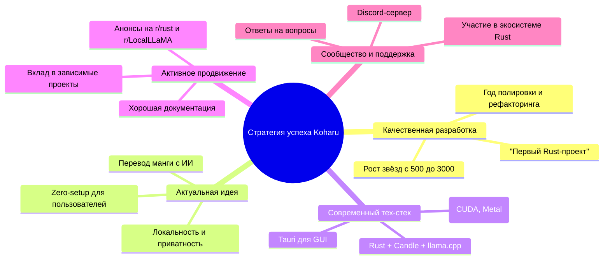

# Стратегия успеха Koharu

Основываясь на анализе обсуждения на Reddit и связанных материалов,
успех проекта Koharu и попадание в топ GitHub Trending — это результат
долгосрочной работы, правильного позиционирования и активного
взаимодействия с сообществом. Стратегия автора включала несколько
ключевых направлений.

## 🛠️ 1. Качественная разработка и постоянное улучшение

Автор потратил **почти год** на полировку и рефакторинг проекта, причём
большая часть кода написана вручную 【turn0fetch0】. За этот период
количество звёзд на GitHub выросло с 500 до 3000, что свидетельствует
о планомерном развитии и накоплении аудитории. Это не разовый проект,
а результат длительной работы, что важно для попадания в тренды.

## 🎯 2. Выбор актуальной и востребованной ниши

Koharu — это **ML-powered инструмент для перевода манги**, который
решает конкретную задачу для чётко очерченной аудитории (переводчики,
фанаты манги) 【turn1search3】. Актуальность обусловлена несколькими
факторами:

* **Популярность AI/ML и LLM**: проект использует современные большие
  языковые модели (LLM) для перевода, что находится на пике интереса
  разработчиков 【turn1search0】.
* **Локальность и приватность**: Все модели и обработка данных
  происходят локально на устройстве пользователя, без отправки в
  облако. Это важное преимущество для многих пользователей
  【turn1search1】【turn1search3】.
* **Zero-setup**: Проект предоставляет готовое настольное приложение
  (Tauri), что снижает порог входа для пользователей, не желающих
  настраивать сложные пайплайны 【turn1search8】.

## ⚙️ 3. Использование современного и привлекательного тех-стека

Техническая реализация проекта привлекает внимание разработчиков:

* **Язык Rust**: Безопасность, скорость и растущая популярность языка
  【turn0fetch0】【turn1search3】.
* **Candle и llama.cpp**: Использование передовых библиотек для
  машинного обучения на Rust, что подчёркивает технологичность
  【turn0fetch0】【turn1search3】.
* **Кроссплатформенность и GPU-ускорение**: Поддержка Windows, macOS,
  Linux, а также CUDA, Metal, Vulkan для высокой производительности
  【turn1search3】.

## 📢 4. Активное продвижение и взаимодействие с сообществом

Стратегия продвижения включала несколько каналов и тактик:

* **Публикация в тематических сообществах**: Автор анонсировал проект
  в сабреддите `r/rust` 【turn0fetch0】【turn1search0】, а также,
  вероятно, в `r/LocalLLaMA` (судя по упоминаниям в поиске)
  【turn1search0】. Это позволило сразу охватить целевую аудиторию
  Rust-разработчиков и энтузиастов LLM.
* **Вклад в зависимые проекты**: Автор внёс вклад в развитие библиотек
  `candle` (добавление моделей, улучшение загрузки) и `cudarc`
  (реализация привязок cuFFT) 【turn0fetch0】. Это не только улучшило
  функциональность Koharu, но и привлекло внимание мейнтейнеров и
  пользователей этих популярных библиотек.
* **Подробная документация и удобный онбординг**: На официальном сайте
  `koharu.rs` есть структурированные руководства, API-документация и
  объяснения работы проекта 【turn1search4】. Это облегчает новым
  пользователям знакомство и использование.
* **Поддержка и обсуждение**: Для проекта создан Discord-сервер, что
  обеспечивает канал обратной связи и формирует сообщество вокруг
  инструмента 【turn1search3】.

## 🤝 5. Участие в экосистеме и кросс-промоушн

Проект не изолирован, а интегрирован в экосистему:

* В README и на сайте есть ссылки на используемые библиотеки (candle,
  llama.cpp) 【turn1search3】【turn1search4】.
* Вклад автора в эти библиотеки создаёт взаимную видимость:
  пользователи `candle` могут узнать о Koharu, и наоборот.
* Проект был замечен и упомянут в независимых обзорах и дайджестах
  (например, в "Horizon Summary") 【turn1search8】, что расширило его
  охват за пределы изначальных платформ.

## 💎 Заключение

Успех Koharu — это не случайность, а результат **долгосрочной
стратегии**, сочетающей качественную разработку в актуальной нише,
выбор правильного технологического стека, активное продвижение в
целевых сообществах и интеграцию в экосистему. Автор не просто создал
проект, но и выстроил вокруг него сообщество, что стало ключом к
вирусному росту и попаданию в GitHub Trending.
